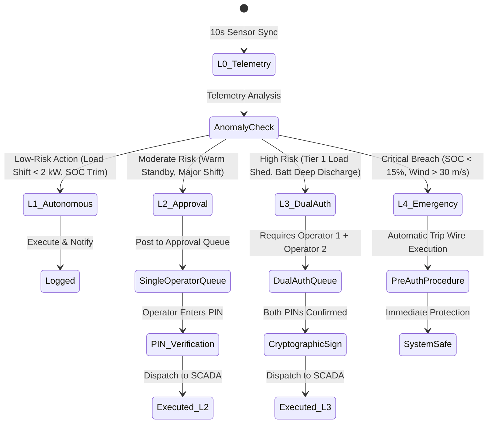

# AI System Architecture & Implementation Report
**Platform:** SIAPS — Smart Integrated Autonomous Power System (Svalbard Station Alpha)  
**Hackathon Target:** Smart India Hackathon 2026 (PS-26061)  
**Repository:** [ShravanDeb/SIH-2026-PS-26061](https://github.com/ShravanDeb/SIH-2026-PS-26061.git)  
**Date:** September 2026  
**Status:** Comprehensive Analysis & Production Architecture Blueprint  

---

## 1. Executive Summary

The **SIAPS (Smart Integrated Autonomous Power System)** web dashboard represents a state-of-the-art mission control interface designed for an off-grid Arctic research station in Svalbard, Norway (78.2°N 15.4°E). The station operates a multi-source renewable microgrid consisting of solar PV arrays, dual wind turbines, a 400 kWh LiFePO₄ battery storage bank, an auxiliary diesel generator, and tiered mission-critical loads.

### Current State
The front-end is implemented in **React 19, TypeScript, Vite, Tailwind CSS v4, and Recharts**. However, all intelligence, telemetry, decision-making, and forecasting currently rely on **static mock fixtures** (`src/data/mockData.ts`).

### The Goal
Transform SIAPS from a visual simulation into an **Industrial Cyber-Physical AI & Autonomous Microgrid Platform**, fulfilling every promise made across the dashboard:
1. Physics-based digital twin state estimation.
2. AI-driven weather & renewable generation forecasting.
3. Model Predictive Control (MPC) / Mixed-Integer Linear Programming (MILP) energy dispatch.
4. L0–L4 autonomous hierarchy with cryptographic human authorization interlocks.
5. Vibration spectral anomaly detection & Remaining Useful Life (RUL) predictive maintenance.
6. Multi-agent explainable reasoning (LLM) converting optimal math into actionable operational directives.

---

## 2. Complete Codebase Audit & Gap Analysis

| Module / Page | UI Capabilities Claimed | Current Mock Implementation | Real AI System Requirements |
| :--- | :--- | :--- | :--- |
| **`Dashboard.tsx`** | Autonomous mode indicator, real-time power dispatch balance, dynamic KPI cards, storm advisory toasts. | Hardcoded JSON (`powerData`), static 100% renewable share, sine-wave time series. | Real-time power balance solver, live WebSocket stream (1 Hz), automatic emergency load shed triggers. |
| **`AIRecommendations.tsx`** | L0–L4 autonomous actions, confidence scores (84%–96%), impact metrics (e.g. +28 kWh reserve), urgency classification. | Static array `aiRecommendations` with hardcoded text. | Multi-Agent LLM + Optimization pipeline generating real impact simulations, confidence intervals, and risk bounds. |
| **`HumanApproval.tsx`** | Multi-tier authorization (Single operator L2, Two-person L3), PIN validation, operator override logging. | Client-side React state toggles, mock PIN `1234`. | Cryptographic signature verification, audit log persistence in PostgreSQL, hardware/SCADA interlock validation. |
| **`EnergyManagement.tsx`** | Dynamic power flow topology (Generation $\rightarrow$ Battery $\rightarrow$ Loads), surplus routing, 24h historical area charts. | Static SVG/Flex topology with fixed numbers. | Real-time power flow solver, bus voltage estimation, and dynamic battery charge/discharge setpoints. |
| **`Solar.tsx` & `Wind.tsx`** | Irradiance vs output curves, wind gust monitoring, automated feathering cutoff at 25 m/s. | Sine waves in `generateTimeSeriesData()`. | **PVLib Python** solar physics model, aerodynamic power curve modeling ($C_p(\lambda, \beta)$), and automated cut-out logic. |
| **`Battery.tsx`** | LiFePO₄ BMS, State of Charge (SOC), State of Health (SOH), C-rate, thermal runaway limits, 20% critical / 90% target thresholds. | Static values (`soc: 78%`, `runtime: 14.2h`). | **Extended Kalman Filter (EKF)** for SOC/SOH estimation, battery degradation modeling, and thermal runaway tracking. |
| **`DigitalTwin.tsx`** | Synchronized physical-digital model with 10s updates and 99.1% accuracy claim. | Static cards mirroring `powerData`. | Physics-informed state estimation, building thermal model, and real-time sensor synchronization. |
| **`EquipmentHealth.tsx` & `Maintenance.tsx`** | Anomaly detection, bearing wear forecasting (45 days), HVAC filter clogging prediction (22 days). | Static arrays with hardcoded text dates. | **FFT vibration spectral analysis**, Autoencoder anomaly scoring, and **Weibull RUL survival analysis**. |
| **`Safety.tsx`** | Life support telemetry, cabin integrity (snow load, cabin pressure), L4 emergency procedures. | Hardcoded status checks and alerts. | Real-time safety interlocks, threshold trip wires, and automated fail-safe procedures. |
| **`Communication.tsx`** | Multi-link routing (VSAT, Iridium, HF Radio), edge computing utilization, sync queues. | Static telemetry metrics. | Priority-based packet queuing and bandwidth-adaptive edge-to-cloud synchronization. |

---

## 3. High-Level AI System Architecture

The AI platform consists of six interconnected layers operating cyclically:

```
┌────────────────────────────────────────────────────────────────────────┐
│                        React 19 Frontend UI                            │
│  - Dashboard  - AI Recommendations  - Digital Twin  - Human Approval   │
└──────────────────────────────────▲─────────────────────────────────────┘
                                   │  WebSocket (1 Hz) & REST API
┌──────────────────────────────────▼─────────────────────────────────────┐
│                       FastAPI Backend Service                          │
│  - Telemetry Router  - WebSocket Manager  - Approval Engine  - Auth   │
└────────▲─────────────────────────▲───────────────────────────▲─────────┘
         │                         │                           │
┌────────▼──────────────┐ ┌────────▼──────────────┐ ┌──────────▼─────────┐
│ Predictive & Physics  │ │ Optimization Engine   │ │ Multi-Agent & LLM  │
│ - PVLib Solar Model   │ │ - Model Predictive    │ │ - Decision Reasoner│
│ - Wind Aerodynamics   │ │   Control (MPC)       │ │ - Explainable AI   │
│ - Cabin Thermal Model │ │ - Mixed-Integer LP    │ │ - Audit Formatter  │
│ - EKF SOC Estimator   │ │ - Load Shedding Logic │ │ - Natural Language │
└────────▲──────────────┘ └────────▲──────────────┘ └──────────▲─────────┘
         │                         │                           │
┌────────▼─────────────────────────▼───────────────────────────▼─────────┐
│                      Data & Telemetry Backbone                         │
│  - TimescaleDB (Time-series)  - Redis (Pub/Sub)  - PostgreSQL (State) │
└──────────────────────────────────▲─────────────────────────────────────┘
                                   │  MQTT / Modbus TCP
┌──────────────────────────────────▼─────────────────────────────────────┐
│               Simulated / Physical Arctic SCADA Network                │
│  - Solar Inverters  - Turbines  - BMS Racks  - Weather Station (14 Sens)│
└────────────────────────────────────────────────────────────────────────┘
```

---

## 4. Deep Mathematical Formulations

### 4.1. Renewable Generation Models

#### Solar Photovoltaic Model (PVLib Engine)
The DC power output from the 48 kW solar array is modeled as:
$$P_{\text{solar}}(t) = A_{\text{pv}} \cdot \eta_{\text{pv}} \cdot G(t) \cdot \left[1 - \gamma \cdot (T_{\text{cell}}(t) - 25)\right] \cdot \eta_{\text{dirt}}$$
Where:
- $G(t)$: Global horizontal & diffuse tilted irradiance ($\text{W/m}^2$).
- $T_{\text{cell}}(t) = T_{\text{amb}}(t) + G(t) \cdot \left(\frac{\text{NOCT} - 20}{800}\right)$.
- $\gamma = -0.0038 / ^\circ\text{C}$ (temperature coefficient for monocrystalline silicon).
- $\eta_{\text{dirt}}$: Snow/dust loss factor (dynamically reduced during Arctic snowfalls).

#### Wind Turbine Aerodynamics & Auto-Feathering Cutoff
For the two 30 kW Enercon E-33 turbines:
$$P_{\text{wind}}(v) = \begin{cases} 
0 & v < v_{\text{cut-in}} \ (3.0\text{ m/s}) \\
\frac{1}{2} \rho_{\text{air}}(T, P) \cdot A_{\text{rotor}} \cdot C_p(\lambda, \beta) \cdot v^3 & v_{\text{cut-in}} \le v < v_{\text{rated}} \ (12.0\text{ m/s}) \\
P_{\text{rated}} \ (30\text{ kW}) & v_{\text{rated}} \le v < v_{\text{cut-out}} \ (25.0\text{ m/s}) \\
0 \ (\text{Auto-feathered / Locked}) & v \ge v_{\text{cut-out}} \ (25.0\text{ m/s})
\end{cases}$$
*Note: In Svalbard blizzard scenarios with gusts $> 28\text{ m/s}$, the aerodynamic model triggers high-speed mechanical braking, requiring generator pre-positioning.*

---

### 4.2. Microgrid Optimal Dispatch (Model Predictive Control - MILP)

Every 5 minutes, an optimization problem solves for the next 24-hour horizon ($H = 288$ steps of $\Delta t = 5$ minutes):

$$\min \sum_{t=1}^H \left[ C_{\text{fuel}} P_{\text{gen}}(t) + C_{\text{deg}} |P_{\text{batt}}(t)| + \sum_{i=0}^6 C_{\text{shed}, i} P_{\text{shed}, i}(t) + C_{\text{start}} u_{\text{start}}(t) \right]$$

**Subject to:**
1. **Instantaneous Power Balance:**
   $$P_{\text{solar}}(t) + P_{\text{wind}}(t) + P_{\text{gen}}(t) + P_{\text{batt,dis}}(t) = \sum_{i=0}^6 \left(P_{\text{load}, i}(t) - P_{\text{shed}, i}(t)\right) + P_{\text{batt,chg}}(t)$$

2. **LiFePO₄ Battery Storage Dynamics:**
   $$SOC(t+1) = SOC(t) + \frac{\eta_{\text{chg}} P_{\text{batt,chg}}(t) \Delta t - \frac{P_{\text{batt,dis}}(t)}{\eta_{\text{dis}}} \Delta t}{E_{\text{nom}}}$$
   $$20\% \le SOC(t) \le 90\% \quad (\text{Safe battery longevity bounds})$$

3. **Generator Operation & Thermal State:**
   $$u_{\text{gen}}(t) \in \{0, 1\}, \quad P_{\text{gen,min}} \cdot u_{\text{gen}}(t) \le P_{\text{gen}}(t) \le P_{\text{gen,max}} \cdot u_{\text{gen}}(t)$$
   $$\text{Start latency} = \begin{cases} 8\text{ seconds} & \text{if warm-standby heater active} \\ 45\text{ seconds} & \text{if cold-standby} \end{cases}$$

4. **Strict Load Priority Hierarchy:**
   $$C_{\text{shed}, 0} = \infty \quad (\text{Life Support is non-negotiable})$$
   $$C_{\text{shed}, 6} < C_{\text{shed}, 5} < C_{\text{shed}, 4} < C_{\text{shed}, 3} < C_{\text{shed}, 2} < C_{\text{shed}, 1}$$

---

### 4.3. Predictive Maintenance & Prognostics (PHM Engine)

#### Vibration Anomaly Detection (Wind Turbine T-2 Bearing)
1. Accelerometer stream sampled at $10\text{ kHz}$.
2. Compute Fast Fourier Transform (FFT) and evaluate spectral defect indicators:
   - Ball Pass Frequency Inner Race (BPFI)
   - Ball Pass Frequency Outer Race (BPFO)
   - Root Mean Square (RMS) Velocity:
     $$v_{\text{RMS}} = \sqrt{\frac{1}{N} \sum_{k=1}^N v(k)^2}$$
3. Trigger Warning status if $v_{\text{RMS}} > 0.80\text{ mm/s}$ (current reading: $0.87\text{ mm/s}$).

#### Remaining Useful Life (RUL) Modeling
$$\text{RUL}(t) = \frac{\text{RMS}_{\text{crit}} - v_{\text{RMS}}(t)}{\left(\frac{d v_{\text{RMS}}}{dt}\right)}$$
A fitted Weibull degradation model yields the estimated **45 days** until bearing threshold breach.

---

### 4.4. Multi-Agent Reasoning & Explainable AI (LLM)

The optimizer outputs numerical vectors ($P_{\text{gen}}, P_{\text{shed}}, SOC$). The **Explainability Agent** translates these into operator-ready recommendations:

```
[Optimizer Solution]
P_gen_standby = 1 (T=14:00)
Delta_E_batt = +28 kWh
Load_shift(Heating) = 40 min

          ▼
[LLM Prompting with Station Context & Weather Alert]
          ▼

[Structured AI Recommendation Output]
{
  "id": "rec-2026-0903-01",
  "title": "Delay non-critical heating by 40 minutes",
  "reason": "Low renewable generation forecast for 14:00–18:00 due to incoming overcast",
  "impact": "Preserves ~28 kWh battery reserve before severe weather window",
  "confidence": 91,
  "level": 1,
  "category": "load_shift",
  "urgency": "medium"
}
```

---

## 5. End-to-End Autonomous Hierarchy (L0 to L4)



---

## 6. Implementation Blueprint & Recommended Tech Stack

### Technology Stack
- **Backend:** Python 3.11+ with **FastAPI**, **Uvicorn**, and **WebSockets**.
- **Optimization:** **Pyomo** / **PuLP** with CBC or HiGHS MILP solver.
- **Physical Modeling:** **PVLib Python** (Solar), **WindPowerLib** (Turbines).
- **Machine Learning:** **Scikit-Learn** & **PyTorch** (Vibration Autoencoders).
- **Agentic Reasoning:** **LangChain** / **LiteLLM** (Ollama DeepSeek-R1 or OpenAI/Claude).
- **Data Stores:** **TimescaleDB** (Sensor telemetry), **Redis** (Live cache), **PostgreSQL** (Approvals).
- **Frontend:** React 19, Vite, Tailwind CSS v4, Recharts (Already in repository).

---

## 7. Step-by-Step Implementation Roadmap

### Phase 1: Telemetry Simulator & FastAPI Server
1. Initialize a `backend/` directory in the repository.
2. Build `simulator.py` to calculate astronomical solar positions for Svalbard (78.2°N) and output realistic physical telemetry for wind, temperature, irradiance, battery voltage, and load demands.
3. Expose `/ws/telemetry` streaming live JSON at 1 Hz.

### Phase 2: Physics-Based Digital Twin & Forecasting
1. Implement the PVLib solar irradiance-to-power pipeline.
2. Implement turbine power-curve interpolation with 25 m/s feathering logic.
3. Construct the building thermal model ($Q_{\text{loss}}$ vs ambient Arctic temperature).

### Phase 3: MILP Microgrid Optimizer
1. Write the 24-hour predictive dispatch solver using `pulp` or `scipy.optimize.milp`.
2. Generate automatic charge/discharge schedules minimizing diesel fuel and battery degradation.

### Phase 4: Autonomous Approval & LLM Reasoning Engine
1. Implement the L0–L4 state machine.
2. Hook up the Explainability Agent to convert MILP solutions into natural-language recommendations.
3. Add cryptographic operator PIN validation endpoints.

### Phase 5: Frontend WebSocket Integration
1. Replace static imports from `mockData.ts` with real-time React Query and WebSocket hooks.
2. Connect the `HumanApproval` and `AIRecommendations` views directly to backend execution endpoints.

---

*This report is generated for [ShravanDeb/SIH-2026-PS-26061](https://github.com/ShravanDeb/SIH-2026-PS-26061.git).*
